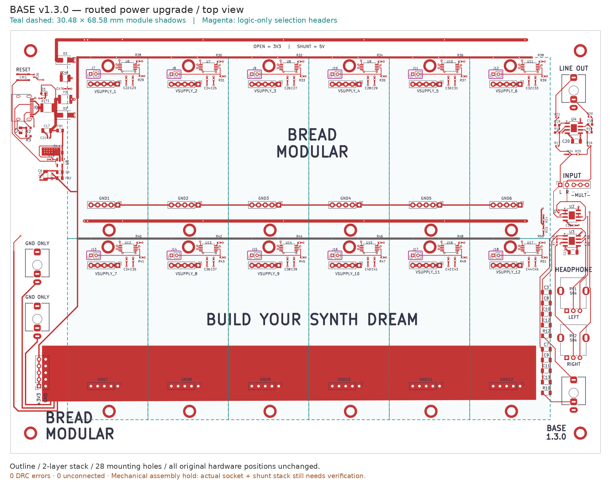
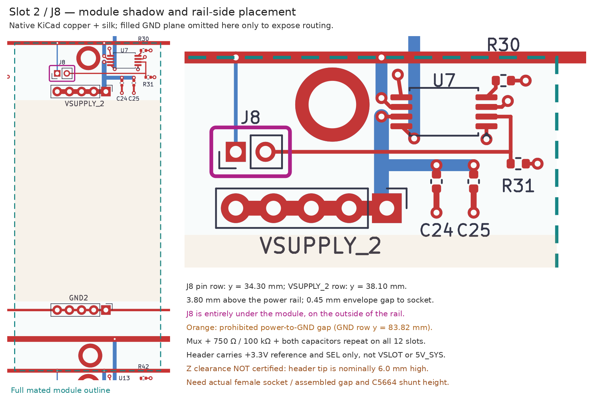

# BASE v1.3.0 — Phase 2 layout verification

**Electrical layout complete; the mechanical assembly release is FAB-READY as of
v1.3.2.** The socket gender question is resolved — the base must carry **female**
1x05 2.54 mm sockets, because 25 of the 27 inspected module boards (28 exist;
`32bit` cannot be loaded standalone) carry a **male** `Conn_01x05_Pin` header on
the bottom side — and the mated stack height is now **calculated from datasheet
dimensions** in `stack-height.json`. No assembled stack has been measured yet; a
mating trial is still advised. The ordering checklist is
[`../production/RELEASE_STATUS.md`](../production/RELEASE_STATUS.md) and the
engineering rationale is POWER.md section 9.

## What changed

- Added and routed all **78** new board components: F1/F2, D2/D3, U6–U17,
  J7–J18, R28–R51 and C22–C47. Total: **163 footprints**.
- Input: both USB VBUS contacts → F1 → VBUS_PROT → FB1/LDO branch and F2;
  F2 → 5V_SYS → twelve mux IN1 pins. D2/D3 cathodes go to their protected
  rails; anodes have short, wide ground connections and paired vias.
- Retained the regulator, FB1/FB2, utility/audio 3.3 V distribution and existing
  hardware. Replaced the old shared slot conductors with isolated VSLOT buses.
  A short audio-feed detour reconnects the original slot-6 take-off to 3.3 V,
  not VSLOT_6. Two audio signal traces detour around channel 12, on the same layer.
- Every VSLOT_n has exactly its five socket pads, mux OUT and two capacitor
  rail pads. Every header pin is a **single 0.25 mm trace endpoint**, not a
  through-route: pin 1 = +3.3V, pin 2 = SEL_n. No VSLOT or 5V_SYS header pad.
- J5's physical A1/A4 lands were renamed B12/B9 to match the existing power-only
  schematic symbol's second GND/VBUS contacts. Their coordinates, sizes and holes
  did not change. Previously those two physical contacts had no PCB nets.
- Cleaned reference-label sizing, moved pad-overlapping jack/switch artwork to
  F.Fab, removed the old filled INPUT silk banner, removed dangling copper, and
  changed the board's printed version to 1.3.0.
- Schematic **byte-for-byte unchanged**. All **85** original footprint positions,
  rotations, pad geometry and UUIDs, all **28 mounting holes**, Edge.Cuts and the
  **two copper layers** are preserved. Actual outline coordinates remain
  (30.48,17.78) to (254.00,177.80): **223.52 × 160.02 mm**.

## Jumper placement interpretation and evidence

The supply sockets are horizontal rows above their corresponding ground sockets.
“On/over the power rail, not in the gap” is implemented as **on the outer/upper
side of the supply row, with the jumper pins parallel to that row**, never on the
module-interior strip between supply and GND. Each header anchor is **3.80 mm above
the supply row**. Its full footprint envelope clears the supply socket envelope
by **0.45 mm**; it remains inside the module shadow.

The 16bit, 8bit, mcc and wave boards all have the same **30.48 × 68.58 mm** outline
(46.99,40.64) to (77.47,109.22), with power at y=50.80 and ground at y=96.52.
Aligning the physical leftmost ground pins (not their reversed front/back pin
numbers) registers the module without changing any connector.

For slot 2:

| Feature | Coordinates / extent, mm |
|---|---|
| Module shadow | x=82.55…113.03; y=27.94…96.52 |
| J8 pin 1 / pin 2 | (91.44,34.30) / (93.44,34.30) |
| J8 full footprint envelope | x=89.915…94.965; y=32.775…35.825 |
| Supply socket full envelope | x=89.625…103.425; y=36.275…39.925 |
| Supply / GND pin rows | y=38.10 / 83.82 |

`connectivity.json` records this check for **all 12 slots**. No additional
bottom-side module component occupies the jumper body area on the four inspected
module boards. This is an XY check, **not a height sign-off**.

The original slot-1 supply row is offset **−0.12 mm in X / −0.10 mm in Y** from the
common module registration. That existing discrepancy was preserved, per the
no-move requirement; check it during the physical mating trial.





These are native KiCad layer plots with measured overlays. Teal dashed lines are
module outlines; magenta surrounds headers; orange marks the forbidden inter-row
area. The zoom shows B.Cu routing in blue, F.Cu in red. **Filled zones are omitted
only from a temporary plotting copy** so routes remain visible. Production uses
the saved, filled PCB. Visual inspection found a consistent repeated cluster and
no text collisions; DRC likewise reports no silk/text/dangling warnings.

## Stack-height proof (v1.3.2 — was "owner decision required")

v1.3.0/v1.3.1 could not close this because the Phase 1 sourcing text was wrong
(`C2894928 / PZ254-1-05-Z-8.5` is a **male** header, and the `2.8 mm` figure on
`C2905948` is its solder tail, not its height above the board). Both are now
resolved from the drawings and calculated in `stack-height.json`:

| # | Feature | Height above the base PCB top | Source |
|---|---|---:|---|
| 1 | Rail-select header `C2905948 / PZ200-1-02-Z` | insulator **2.0** + mating pin **4.0** = **6.0** | [source](https://jlcpcb.com/partdetail/HCTL-PZ200_1_02Z/C2905948) |
| 2 | Shunt `C5664` seated on (1) | 2.0 + **3.5** = 5.5 — below (1), so it does not extend the envelope | [source](https://www.lcsc.com/datasheet/C5664.pdf) |
| 3 | **Jumper envelope** = max(1, 2) | **6.0** nominal / **6.6** worst case | |
| 4 | Recommended female socket `C2897368` | insulator **8.5** | [source](https://www.lcsc.com/datasheet/C2897368.pdf) |
| 5 | Module male header insulator (bottom mounted) | **+2.5** | [source](https://jlcpcb.com/partdetail/Hctl-PZ254_1_05_Z_85/C2894928) |
| 6 | **Module PCB underside** = (4) + (5) | **11.0** nominal / 10.4 worst case | |
| 7 | **Clearance (6) − (3)** | **5.0 mm** nominal / **3.8 mm** worst case | |

The target is **≥ 0.5 mm** above the worst-case fitted envelope, so 3.3 mm of
margin remains. Worst case here means every stacked nominal dimension moves by
the drawings' general `X.X ±0.30` tolerance in the direction that closes the gap.
The **minimum socket insulator height is 6.3 mm**, set by the need to swallow the
module's worst-case 6.3 mm mating pin (the jumper-clearance bound is the weaker
one at 4.9 mm); because a part is bought by its nominal label, the assembly note
asks for a **6.6 mm nominal part**. That also covers the tallest 5.0 mm shunt
option of the C5664 family — with the jumper's own tolerance applied to the shunt
side, worst-case clearances are 3.5 mm → 3.8 mm, 4.5 mm → 3.3 mm, 5.0 mm → 2.8 mm.

`tools/verify_stack_height.py` recomputes the whole table, fails the release if
any published number disagrees, and additionally registers every module footprint
into base coordinates (module's leftmost physical ground pin onto the base
slot's leftmost ground pad) to prove that **no module bottom-side footprint
overlaps the jumper envelope** on any of the 12 slots. The nearest module-side
body outline is **0.45 mm** away in X/Y, and the module connector insulators sit
1.9 mm above the jumper's worst-case top.

Still open, and listed in `../production/manifest.json` as
`physical_validation_pending`: no assembled stack has been measured; the module
male-header part number is not annotated on the module PCBs; the socket drawings
publish the housing height but not the internal contact depth, so full pin
engagement is assumed rather than proved; slot 1's socket row keeps its
pre-existing −0.12 mm / −0.10 mm offset; and 4mix/imix place their power headers
on `F.Cu` where they cannot mate downwards as drawn. `stack-height.json` also
persists the per-module `exceptions` and the `coverage` counts behind these
claims, the SHA-256 fingerprints that make the report self-invalidating when an
input changes, and the top-side through-hole tail check (1 332 parts examined,
1.4 mm nominal / 1.86 mm worst-case tail, 0.45 mm nearest XY gap, 1.94 mm
worst-case clearance) for the two boards that mount their headers on `F.Cu`.

## Trace widths, clearances and ground

Assumption: **35 µm / 1 oz external copper**, **10 °C rise** screening calculation.
IPC-2221 external-layer fit: `I = 0.048 × rise^0.44 × area_mil²^0.725`.
It gives minimum widths of **0.172 mm at 0.667 A**, **0.343 mm at 1.1 A**, and
**0.781 mm at 2 A**. This is a sizing estimate, not a thermal test under modules.
The fabrication house's IPC-based calculator describes the model and its limits. [source](https://www.advancedpcb.com/en-us/tools/trace-width-calculator/)

| Routing | Implemented width / drill |
|---|---|
| F1/VBUS_PROT main current path | 1.2 mm; 1.0 mm protected LDO/bulk branch |
| USB contact fanout | two separate 0.5 mm legs, widening at their merge |
| 5V_SYS row buses and input trunk | 1.2 mm |
| New 3.3 V row buses / mux input branches | 0.8 mm (original regulator/audio/utility tracks retained) |
| VSLOT socket buses and main output runs | 1.0 mm |
| Capacitor branches | 0.4–0.8 mm |
| Short TSSOP pin escapes and logic | 0.25 mm; power escape segments approximately 1.2–1.34 mm |
| New ordinary vias | 0.8 mm diameter / 0.4 mm drill |
| Main 5 V layer transitions | paired 1.0 mm diameter / 0.5 mm drill vias; C46 local branch 0.8/0.4 |

General clearance remains **0.20 mm**, minimum track width **0.20 mm**, minimum via
0.70 mm and annulus 0.15 mm; the original global DRC severities and ERC settings
are unchanged. The only clearance exception is an explicit **0.15 mm pad-to-pad
rule wholly inside J5**, whose fixed USB land pattern has 0.175 mm nominal gaps.
It does **not** relax tracks, other parts or the power rails. The two inherited
silent J5 exclusions were removed; final exclusions are empty.

Ground strategy: a filled, board-wide **B.Cu GND plane** (0.25 mm local clearance,
0.4 mm thermal spokes), with short new return traces and local vias at mux ground,
manual-mode pins, resistors and capacitors. Original local pour definitions and
socket GND conductors remain; redundant right-edge GND links were replaced by the
continuous back plane. No return depends on a jumper. Zones were refilled using
the real project settings before final DRC and production export.

### FB1/FB2 land-pattern close-out

Retained the existing capacitor-named 0805 footprint **without moving/resizing its
pads**: each pad is **1.00 × 1.45 mm**, center spacing **1.90 mm**, hence inner gap
**0.90 mm**. Sunlord PZ series Table 4-1 specifies the 2012 recommended dimensions
as `A` (gap) **0.80–1.20**, `B` (pad length) **0.80–1.20**, `C` (width)
**0.90–1.60 mm**. All three actual land dimensions are inside those ranges; the
library nickname need not be changed. This does not change the Phase 1 sourcing
substitution decision. [source](https://www.alfatec.de/fileadmin/productfiles/datasheets/sunlord_pz_series.pdf)

## DRC and electrical verification

KiCad CLI **9.0.8**. Both reports include the same flags:

```sh
kicad-cli pcb drc --format json --schematic-parity --severity-all \
  -o modules/base/verification/drc-after.json modules/base/base.kicad_pcb
/usr/bin/python3 modules/base/tools/verify_power.py \
  --report modules/base/verification/connectivity.json
```

| Finding | Before (v1.2.0 PCB) | After |
|---|---:|---:|
| Active DRC errors | 0 | **0** |
| Previously excluded errors, also exposed by `--severity-all` | 2 | **0** |
| Unconnected items | 0 | **0** |
| Schematic-parity findings | 170 | **0** |
| DRC warnings | 110 | **59** |
| Silk/text/dangling warnings | 57 | **0** |

The before board was fully connected to its **old** nets, not the merged schematic;
its zero ratsnest count was not parity evidence. Final verification passes **1713
assertions** over pin nets/values/sourcing fields, protected geometry, original
project rules/ERC, header leaf routing and all module shadows. No ghost nets remain.
A separate temporary-board test physically removed all twelve header footprints;
independent KiCad DRC still found **0 errors / 0 unconnected items**, proving that
no power connection relies on header copper (`header-removal-proof.json`).
The forensic layout generator was also smoke-tested to a separate board with
zero DRC errors/unconnected items and identical component/net/placement data.
The existing fabrication exporter passed **all 28 tests, including its three
KiCad integration tests**.

### Retained warnings

All 59 are `lib_footprint_mismatch`, not copper connectivity or placement errors:

- **53 inherited instances** retain their existing library-revision/customized
  geometry instead of blindly replacing lands and disturbing the routed board.
- **J5** intentionally adapts two physical pad names to the schematic as explained
  above. Do not refresh it from the unadapted shared footprint without preserving
  that mapping.
- **J1/J2/J4/J6/SW1** intentionally move only pad-overlapping internal silk artwork
  to F.Fab; physical pads and hardware positions remain unchanged.

Full per-instance findings are in `drc-after.json`; reference list is in
`warnings.md`. The inherited mismatches are not a fresh qualification of every
legacy component's manufacturer land pattern. Do not suppress the warnings or
interpret a routed-board DRC pass as assembly certification.

## Production outputs and reproduction

Run after saving/refilling the PCB:

```sh
/usr/bin/python3 modules/base/tools/regenerate_production.py
/usr/bin/python3 modules/base/tools/plot_power.py
```

The regeneration script refuses DRC errors (including excluded errors), missing
connections, or schematic-parity findings. It emits:

- `production/netlist.ipc` — KiCad IPC-D-356, containing the new protected/slot nets.
- `production/designators.csv` — legacy `ref:1` mapping, **163 refs**.
- `production/bom.csv`, `production/positions.csv` — full **163-component**
  hand-assembly-inclusive BOM/CPL. Positions now use native KiCad footprint anchors,
  not Fabrication Toolkit's old auto-translated body centroids; the drill/place
  origin is shared with the Gerbers.
- `jlcpcb/base/{bom.csv,positions.csv,export-report.json,base-gerbers.zip}` —
  **119 SMD components / 32 BOM groups**, with all LCSC numbers present.
- `production/base.zip` and `jlcpcb/production_files/GERBER-base.zip` — exact copies
  of that fresh fabrication ZIP, not stale alternate exports.
- `jlcpcb/gerber/` — freshly extracted **9 Gerbers + PTH/NPTH drills**. Legacy
  renamed Gerbers, stale drill-map PDFs and the old non-copper VScore plot were
  removed rather than mixed with current data. Historical `production/backups`
  and the old JLC plugin database are not production inputs and were not changed.
- `production/manifest.json` records the release status (`fab-ready`), the source
  and artifact SHA-256 hashes, the hand-solder override hash and the pending
  physical validations. The JLC report contains source hashes as well.

Gerber/CPL generation succeeded. The socket/shunt stack is calculated from datasheet dimensions
(above); the assembler's part and rotation preview is still a manual step before
an order is approved.

For forensic layout reproduction only, `tools/apply_power_layout.py` accepts an
explicit pre-upgrade PCB and fresh schematic XML. It checks the baseline PCB hash,
loads the real project design rules, and uses `SaveBoard(..., aSkipSettings=True)`
to prevent standalone pcbnew from overwriting the project/ERC settings. Do not
re-run it against later hand-edited layouts; the routed PCB is the deliverable.

## v1.3.1 structure refactor — netlist identity evidence

v1.3.1 moves the twelve flat per-slot power blocks into the hierarchical template
`slot.kicad_sch` (instantiated as `Slot1` … `Slot12`). It is a drawing change
only; the PCB is intentionally untouched. The evidence in this directory:

- `netlist-before.kicadsexpr` — flat netlist exported from the v1.3.0
  `base.kicad_sch` (HEAD before the refactor).
- `netlist-after.kicadsexpr` — flat netlist exported from the v1.3.1 schematic.
- `erc-before.json`, `erc-after.json` — ERC reports (`--severity-all`).
- `slot-refactor-netlist-diff.md` — the tool-generated comparison: **78 nets,
  513 nodes, 163 components, identical names/membership/values**, plus the
  per-instance reference table.
- `slot-template.svg` — plot of the template sheet for review.

Reproduce with:

```sh
kicad-cli sch export netlist --format kicadsexpr -o verification/netlist-after.kicadsexpr base.kicad_sch
kicad-cli sch erc --format json --severity-all -o verification/erc-after.json base.kicad_sch
tools/verify_slot_refactor.py --before verification/netlist-before.kicadsexpr \
    --after verification/netlist-after.kicadsexpr \
    --erc-before verification/erc-before.json --erc-after verification/erc-after.json
```

`production/netlist.ipc` is exported from the **PCB** (not the schematic) and is
byte-identical; `kicad-cli pcb drc --schematic-parity` still reports 0 unconnected
items and 0 schematic-parity findings. The only netlist-file differences are the
per-component `Sheetname` / `Sheetfile` properties and 48 instance-neutralised
`Description` texts (see POWER.md section 8).

## Fixed-geometry baseline re-established after the v1.3.1 slot-template refactor (2026-09-17)

`fixed-geometry.json` carried the **v1.3.0** schematic pin while the committed
schematic is the **v1.3.1** one, so the documented regeneration path stopped at the
first guard:

```
AssertionError: Merged schematic changed (including text): explicitly forbidden by this task
```

That was the guard working, not a broken check: v1.3.1 intentionally rewrote
`base.kicad_sch` (the twelve flat slot blocks became the `slot.kicad_sch` template
instantiated as `Slot1`…`Slot12`), so the pinned hash was stale.

**What moved, and what did not:**

| pinned field | action | value |
|---|---|---|
| `schematic_sha256` | **updated** (v1.3.0 `eebbfee9…` → v1.3.1 `42b0fde4…`) | current committed `base.kicad_sch` |
| `copper_layers` | unchanged, still matches | 2 |
| `footprints` (85 entries) | unchanged, still matches | 85 original refs, verified against the live board |
| `edges` (4), `mounting_holes` (28) | unchanged, still match | verified against the live board |
| `project_design_rules`, `project_rule_severities`, `project_erc`, `project_schematic` | unchanged, still match | identical to the committed `base.kicad_pro` |
| `pcb_sha256` | unchanged, still matches | `de29cdaa…` — deliberately the **pre-upgrade (v1.2.0) board** consumed by `tools/apply_power_layout.py`'s "refuse to re-apply to a routed board" guard, **not** the routed board `9fc20400…` |

No check was deleted, relaxed or excluded — only the pinned hash of an
intentionally changed source file moved. Both documented invocations were re-run on
2026-09-17 and complete: `verify_power.py --report verification/connectivity.json`
passes the same **1713 assertions**, and `regenerate_production.py` exports IPC/BOM/
CPL and synchronizes the three fabrication archives. The rerun is not a board
change: `base.kicad_pcb` stays at `9fc20400ad6268ae35720c288995e211e4cbe28019649b2265d493139e2dc484`,
`production/bom.csv`, `production/positions.csv`, `production/designators.csv`,
`production/netlist.ipc` and the JLC BOM/CPL regenerate byte-identically, and the
eleven gerber/drill files differ from the committed ones only in their two KiCad
export-date comment lines each (**22 changed lines across 11 files**). That
date-only churn was discarded so every hash recorded in `production/manifest.json`
still matches the committed bytes. A throwaway copy under `/tmp` with one edited
character in `base.kicad_sch` still fails the same guard, so the check remains
effective.

## v1.3.2 hand-solder record, BOM override and new guards

v1.3.2 touches **docs, tooling and generated outputs only**. `base.kicad_sch`,
`slot.kicad_sch` and `base.kicad_pcb` are byte-identical to v1.3.1, so the v1.3.1
netlist pair above is still the current after-state and
`tools/verify_slot_refactor.py` still reports IDENTICAL.

**Why the schematic was not edited.** The sockets' `LCSC`/`MPN` fields also live
on the routed `base.kicad_pcb` footprints, and `tools/verify_power.py` asserts
schematic/PCB field parity. Re-substituting the socket part in KiCad would
therefore have required rewriting the pinned, byte-identical PCB and deleting a
guard. Instead:

* `../production/hand-solder.json` — hand-maintained, versioned release input:
  the seven hand-solder groups, the required/recommended parts, the datasheet
  numbers and the stack-height specification. Its SHA-256 is recorded in
  `manifest.json` as `hand_solder_override_sha256`.
* `../production/hand-solder.csv` — the generated one-row-per-reference list
  (44 refs) of what the builder fits and where.
* `tools/regenerate_production.py` applies the override to the **generated**
  `production/bom.csv` only (`LCSC Part #` → `NOT-JLC`, the convention the jacks
  and pots already use) and then refuses the export unless: the routed PCB still
  matches the `routed_pcb_sha256` pin; the override changed exactly the intended
  references and no BOM row mixes hand-solder and assembly refs; `C2894928` and
  `C2894966` are absent from the BOM; no hand-solder ref reaches the JLCPCB
  BOM/CPL; and the exporter's own exclusion set equals the hand-solder list
  exactly (44 refs, all excluded as through-hole).
* `verification/fixed-geometry.json` gains `routed_pcb_sha256` (the deliverable
  board pin) and `slot_schematic_sha256`; `tools/verify_power.py` checks both and
  now reports `stack_height_verified: true`, `release_status: fab-ready` and an
  explicit `physical_validation_pending` list instead of the old hold text.
* `tools/verify_stack_height.py` produces `stack-height.json` — the datasheet
  calculation, the module gender inspection, the coverage counts and the
  per-slot envelope check described in the stack-height section above.
* `tools/estimate_cost.py` produces `../production/cost-estimate.json`, the
  sourced **partial** component subtotal quoted in
  `../production/RELEASE_STATUS.md` (154 of 163 designators priced; the rest and
  the PCB/SMT charges are listed as unpriced). It is the only tool that touches
  the network, and only with `--refresh`, so the regeneration path above stays
  offline.
* `tools/verify_power.py --selftest` exercises the staleness guard on
  `stack-height.json` (changed board, changed module PCB, missing fingerprints)
  without touching the board, and it is cheap enough to run alongside the
  documented path.

**Artifact delta.** After regeneration the eleven gerber/drill files differ from
the previously committed ones **only in their two KiCad export-date comment lines
each** (22 changed lines across 11 files); every copper, mask, paste and drill
coordinate is unchanged, and the zip contents differ only by the same 22 lines.
`production/bom.csv` changes substantively — that is the intended override.
`production/positions.csv`, `production/designators.csv`, `production/netlist.ipc`
and `jlcpcb/base/{bom,positions}.csv` regenerate byte-identically.

**Still not verified:** a measured assembled stack (mating trial), the module
male-header part number (not annotated on the module PCBs), the internal socket
contact depth, the `5V14` straight 2x05 female part number, the PCB-fabrication
and SMT-assembly share of the board cost (a quote is required; the component
estimate in `cost-estimate.json` excludes it), and the assembler's part/rotation
preview.
