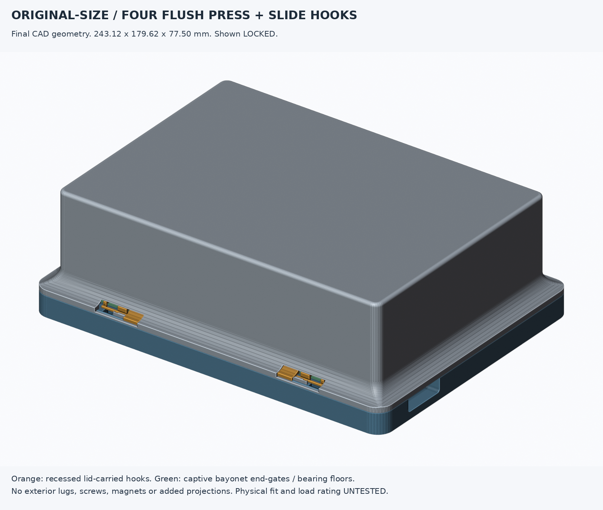
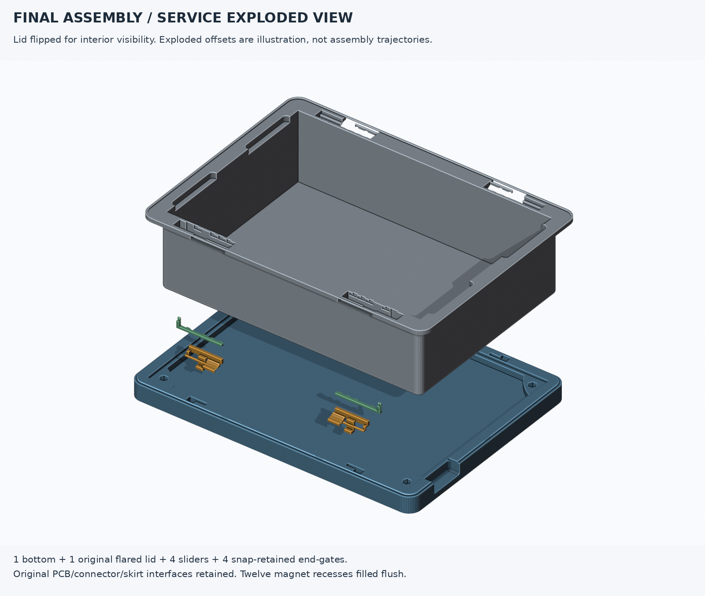
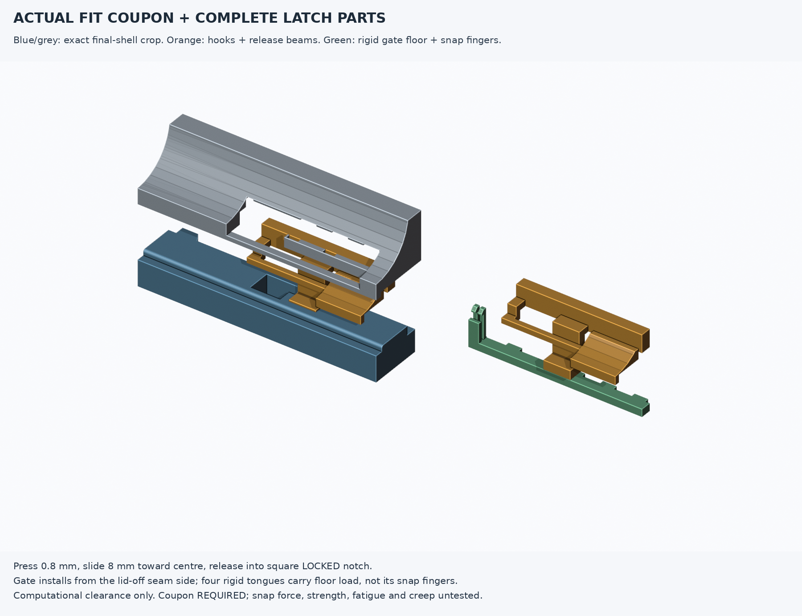

# Original-size flush press-and-slide closure — final CAD delivery

**Computational geometry validated; physical fit, strength and fatigue UNTESTED. Print the latch coupon first.** This is the implemented four-latch assembly, not the historic concept handoff. No screws, magnets, glue, external tabs or larger case envelope.



## Files / BOM

| Item | Quantity | File / location |
|---|---:|---|
| Editable full FreeCAD assembly, saved LOCKED | 1 | `cad/flush-latch.FCStd` — open with `Open.FCMacro` |
| Original-size bottom, opening up on bed | 1 | `stl/case_bottom.stl` |
| Original flared lid, roof down on bed | 1 | `stl/case_lid.stl` |
| Hand A slider + bayonet end-gate | 2 each | `stl/slider_A.stl`, `stl/gate_A.stl` |
| Hand B slider + bayonet end-gate | 2 each | `stl/slider_B.stl`, `stl/gate_B.stl` |
| Real-geometry lower/upper fit coupon | 1 each initially | `stl/coupon_bottom.stl`, `stl/coupon_lid.stl` + one A slider/gate |
| Geometry recipes and dimensions | — | `latch_features.py`, `parameters.json`, `build.py` |
| Enforced full-geometry / written-mesh checks | — | `validate.py`, `reports/validation.json`, `reports/mesh-export.json` |
| Print and fit procedure | — | `PRINT_AND_ASSEMBLY.md` |
| Provenance / delivery verification | — | `provenance.json`, `reports/delivery.json`, `SHA256SUMS` |

A = front-left / rear-right; B = front-right / rear-left, after rotation in the assembly. “Front” is Y0. Hook insertion centres remain X50 and X193.12 on each long wall; all slides move **toward the case centre to lock**.

## Original size and interfaces retained

- Nominal assembly: **243.12 × 179.62 × 77.50 mm**. Trim-aware CAD and actual written STL dimensions agree with the untouched release within 0.0001 mm; measured release approximately **243.119995 × 179.620010 mm**. No envelope growth.
- Bottom Z0..15, seam Z15, original lid skirt down to Z14, inner bottom floor Z8 and inside lid roof Z75 are unchanged. Original flared profile, upper walls, electronics cavity, PCB mounting holes/recesses and connector cutouts are retained. Exterior changes are only the four recessed actuator access wells; each well is 29.6 mm tangentially × 4.9 mm high, including service-loading allowance.
- New sliders and gates are checked against the **actual original occupied wall material** throughout sampled normal motion, not a generic larger bounding box. Loading bays remain within the original thick low rim; no cavity-side reinforcing protrusions.
- All **12 magnet recesses and their mouths** are filled using overlapping native 6.32 mm square patches: bottom Z12.95..15, lid Z15..17.15. The 1 mm alignment skirt is untouched.
- Only the defective 0.5 mm internal cosmetic engravings are suppressed, flush to the original floor/roof planes. No whole-shell rewrite, floor thickening or cavity-height reduction.

Coordinates, mm: `X=releaseX-20.68; Y=-releaseZ-7.98; Z=releaseY+15`.

## Implemented mechanism and necessary handoff refinements

The four lid-carried hooks enter the lower keyways vertically in OPEN. Press the contoured paddle **inward 0.8 mm**, slide **8 mm** toward the centre, then release into the square-tooth LOCKED notch. Both OPEN and LOCKED are positive retained positions, not friction-only locks. Paddle surface is 0.8 mm behind the actual original flare; no knob is added.

| Final feature | Geometry / measured contact |
|---|---|
| Hook | 6 mm tangential width, 2 mm toe thickness; R0.25 toe/stem root |
| Rigid stem | 1.7 mm thick; inner toe/stem moved from inward Y8.4 to Y8.1 |
| Bottom minimum continuous inner skin | **1.2 mm**, improved from the handoff’s 0.9 mm |
| Catch | 2.3 mm shelf; **6 × 2.5 = 15.0 mm²** toe/shelf contact per latch |
| Running clearance | 0.3 mm per face; meaningful toe overlap preserved, not traded away for a thicker generic case |
| Head / guide | 28 × 2.4 × 4 mm; shifted within the rim to Y9.1..11.5, Z18..22 |
| Head bearing floor | **1.7 mm**, supplied by the removable rigid end-gate floor; **67.2 mm²** measured head contact |
| Lid minimum continuous inner skin | **1.3 mm** including the deepest gate-seat pockets |
| Spring release | Nominal 18 × 1.2 × 1.2 mm leaf; R0.4 root; 0.6 mm tooth engagement, 0.2 mm released clearance |
| Gate vertical retention | Four rigid 3 × 0.6 mm tongues; **6.48 mm²** measured contact with integral lid lands |
| Gate axial retention | Two square-sided snap fingers; 0.3 mm engagement, 0.5 mm deliberate service press |

**The concept’s tiny proposed end-cap did not provide a real assembly path for its 28 mm rigid head.** The implemented gate is therefore a flush **bayonet end-gate plus removable rail floor** (38.6 × 3.3 × 8.2 mm), still entirely inside the original wall. The service loading bay is approximately X25.7..73.3 for the front-left site; right/rear sites mirror it. A pressed slider enters upward from the lid-off seam in that bay, then travels tangentially 11 mm to OPEN. The gate enters from the seam at a 3 mm outboard offset, seats 3 mm toward the centre, and its paired square detents snap into their notches.

The separation load path is **integral lid lands → rigid gate tongues/floor → rigid slider head/neck/stem/toe → lower catch → original bottom rim**. Neither the slider release leaf nor the gate snap fingers is the vertical load-bearing element. Gate/floor nominal bearing planes intentionally seat in contact; 0.3 mm side/top clearances are provided. Do not force a printed gate to compensate for incorrect extrusion or support residue.

Two practical 0.3 mm axial running gaps remain: up to **0.6 mm nominal seam lift** before load is carried. This closure **retains, but does not compressively seal**, the lid. No weatherproofing, carrying/drop rating or guaranteed force is claimed.




## Evidence and limitations

The final report enforces all mandatory checks against the **reopened/recomputed complete assembly**, not just cached concept coupons:

- Every separate case/slider/gate is one valid closed CAD solid; an actual parameter edit and restoration changes/reproduces slider volume.
- Original/new width, depth, height; sampled outside profiles; whole-shell material differences outside explicit repair/latch masks; independent PCB/connector/relief/skirt neighborhoods.
- Twelve filled magnet cores **and mouths**, flush engraving repairs, zero bottom/lid seam material overlap.
- Four-site sampled pressed travel, retained endpoints, OPEN insertion/lift, LOCKED separation obstruction, measurable toe/shelf, head/floor and rigid gate/lid load contacts.
- Pressed seam-side slider assembly, gate insertion/bayonet seating, square gate detent retention, and released slider escape obstruction with gates installed.
- Written bed-oriented STL files: closed, single component, manifold, consistently oriented, zero detected self-intersections. No face deletion, generic mesh repair, or weakened print-part assertion is used.
- The coupon is an exact crop of the final shells, verified by CAD differences, not a generic test block.

**Elastic release and snap assembly are explicit clearance surrogates**, translating flexible regions; they are not a rigid sweep masquerading as real snap deflection. A nominal linear cantilever screen gives approximately **0.52% slider strain** (effective length 16.6 mm, 1.2 mm thickness, 0.8 mm press) and **1.56% gate-finger strain** (6.2 mm, 0.8 mm, 0.5 mm press). These use assumed isotropic material behavior, neglect stress concentration/print anisotropy, and are **not strength, force or fatigue verification**. Modulus/force assumptions are recorded in JSON; actual force may be dominated by friction and the jogged root. A shorter 5.2 mm gate load-point assumption raises its nominal strain to about 2.22%, so the 2% nominal screen is not a worst-case strain guarantee.

Physical fit, support removal, beam survival, creep, fatigue, load, drops and slicer behavior remain untested. The gate’s 0.6 mm bearing overlap and 1.2 mm tongue thickness are particular coupon/strength-test priorities. Do not carry valuable electronics by an untested latched lid.

## Honest source/editability scope

`original/case_1.0.0` is the untouched upstream archive and metadata copied from the authorized handoff. Its Fusion F3Z is preserved but **cannot be loaded here as native parametric FreeCAD history**. The original shells are faithful, frozen **faceted BReps** converted from released STLs. Repairs, local tools, sliders, gates and assembly placements are editable analytical FreeCAD `FeaturePython` geometry, with original reference links and exposed dimensions.

Use `Open.FCMacro` so `latch_features.py` is on FreeCAD’s Python path before reopening/recompute. Shapes remain readable without the proxy, but live edits require that module. Some tightly packed gate/bay coordinates are fixed recipe dimensions in `latch_features.py`; not every value in `parameters.json` is an independent safe GUI knob. Source-interface dimensions are constrained deliberately; rerun the complete checks after any edit. Slider `Travel=0` is OPEN, `Travel=8` LOCKED; intermediate *unpressed* placements are not valid operating motion.

`concept-handoff.md`, `cad/local-latch-concept.FCStd`, `concept_*.py`/`build_concept.py`, `reports/concept-checks.json` and `previews/concept-handoff.png` are **historic phase-1 material only**, superseded by this assembly and `reports/validation.json`.

## Reproduce / final state

From repository root, with the already installed runtime:

```sh
opt/travel-case/flush-latch/run.sh
```

`run.sh` uses `set -euo pipefail`, builds the CAD/print meshes, then validates with `&&`; a failed build cannot be hidden by a later successful validation. Rendering consumes full actual final meshes only. Optional clipping/STEP is deliberately absent from the mandatory build.

Work is confined to `opt/travel-case/flush-latch` and untouched `opt/travel-case/original/case_1.0.0`, based on `case-improvements` in the isolated worker branch. Intended files are staged but **uncommitted**; no commit, merge, push, advisor/model call or branch change. `.cache/`, backups and bytecode are ignored.
