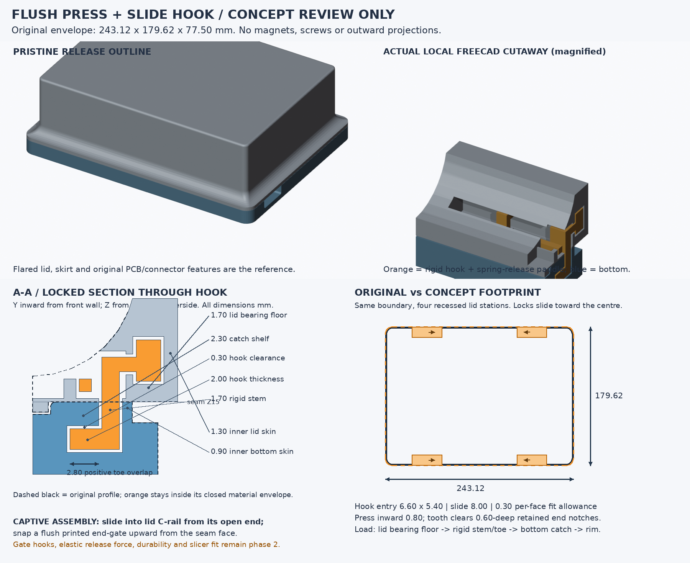

# HISTORIC phase-1 concept — superseded by README.md and reports/validation.json

# Flush sliding-hook closure — concept handoff only

**Recommendation:** four recessed **press-and-slide hook latches carried by the lid**, two on each long wall, engaging keyway catches machined into the bottom's existing rim. They have positive retained OPEN and LOCKED positions, not friction-only detents. No magnets, screws, exterior tabs, feet, knobs or projections. This is phase 1, not a printable full-case delivery. Stop for review here.



## Independently measured fit

Untouched release STLs restored only from checkpoint `252bc256b1b926c6568de9b1831dce3bb5817c1f`. The worker in workspace 263 was read for conversion/repair lessons only; no rejected scripts, lugs, screws or exports were imported. FreeCAD/OCC converted the pristine meshes independently in this workspace.

Coordinate transform, mm: `(X,Y,Z) = (release X-20.68, -release Z-7.98, release Y+15)`.

| Actual release measurement | Result |
|---|---:|
| Footprint | 243.119995 × 179.620010 mm (nominal 243.12 × 179.62) |
| Bottom extent / original inner floor | Z0..15 / Z8 |
| Lid skirt / inside roof / outside roof | Z14 / Z75 / Z77.5 |
| Bottom straight-wall material at Z8.01..12 | inward Y0..12.10 |
| Bottom rim at Z13.3 | Y0..9.60 |
| Bottom rim at Z14.5 / 14.9 | Y1.75..9.60 / Y1.95698..9.60 |
| Lid rim at Z15.01..17 | Y0..14.00 |
| Lid flared wall at Z18 / 20 / 22 | outer Y2.96576 / 6.54841 / 8.34447; inner Y14 |
| Upper straight lid wall, Z28..74.9 | Y10..14 |

These are actual material intervals at X50 and X193.12, with additional samples around the station bands. Rear values are reflected about Y89.81. The thick **low flared rim**, not the thin upper wall or electronics cavity, supplies the latch space.

Proposed hook-entry centres are X50 and X193.12 on both front/rear walls. Left station including loading-gate allowance occupies X34.5..73.3; right is mirrored X169.82..208.62. Lid machining stops at inward Y12.7, leaving **1.3 mm inner skin**. Bottom machining stops at inward Y8.7, leaving **0.9 mm inner rim skin** at the narrowest seam section. Receiver bottom Z10.1 is 2.1 mm above the original inner floor. PCB holes/recesses, connector cuts, skirt/alignment and flared outer profile are not proposed for relocation or replacement.

The slider is additionally checked against **the actual original occupied closed material**, not merely an enclosing cuboid: the hook replaces material removed from the bottom rim and the rail/button replaces lid-wall material. Four placement sites and sampled strokes are reported in `reports/placement-checks.json`. No electronics-space addition is needed. Case extrema remain 243.12 × 179.62 × 77.5; the preview's placement outline is precisely the original footprint, not a larger bounding box. Full final-shell preservation/envelope assertions belong to phase 2.

## Dimensioned mechanism and motion

- **Hook:** 6 mm wide along X; 2 mm toe thickness, Z10.4..12.4; inward Y3.6..8.4. Stem Y6.7..8.4 is 1.7 mm thick.
- **Bottom keyway:** entry 6.6 × 5.4 mm, open through the rim. A continuous 2.3 mm-wide stem slot permits **8 mm tangential translation**. The locked toe is fully beyond the insertion opening and overlaps an integral shelf by **6 × 2.8 mm = 16.8 mm² per latch**. Shelf underside Z12.7; thickness **2.3 mm** up to Z15. Toe/shelf axial clearance is 0.3 mm. Catch outer anchoring material is approximately 1.34 mm minimum near the original rim chamfer; strength is not yet physically established.
- **Captive guide:** 28 × 2.4 × 4 mm rigid slider head, inward Y10..12.4, Z17..21; 0.3 mm clearance per guide face. Integral lid C-rail retains it vertically and radially. Its bearing floor is **1.7 mm**, original inner skin **1.3 mm**. Head/floor nominal bearing area is 67.2 mm². The spring is not in the opening-load path.
- **Accessible action:** contoured thumb paddle is 10 mm long × 4 mm high, Z15.6..19.6, recessed **0.8 mm behind the measured original flare**. Its roughly 18.6 × 4.6 mm swept access well is on the lid wall immediately above the seam. Press inward **0.8 mm**, then slide **8 mm toward the case centre** to lock. Release pressure so a square-sided tooth enters the LOCKED notch. This requires a deliberate action, not lid-roof access or a protruding knob.
- **Positive positions:** an 18 × 1.2 × 1.2 mm outboard cantilever carries a tooth engaging **0.6 mm** into either of two lid-rib notches 8 mm apart. Pressing clears the tooth by 0.2 mm in the geometric surrogate. A 1.2 mm fixed rib sits behind the lower paddle, with an over-rib paddle bridge; the paddle's inward travel does not hit the rib. Actual elastic deformation/press force is **not** simulated or tested.
- **Closure:** put all four sliders in retained OPEN; lower the lid vertically, seating the original 1 mm skirt overlap and passing each toe through its entry keyway. Press and slide each paddle toward the centre; release into its LOCKED notch. Do not use the latches to force a misaligned lid into place.
- **Release:** support/set down the case and fully seat/unload the seam. Press each paddle inward and slide it outward 8 mm into retained OPEN; then lift the lid vertically at least 4.6 mm to clear the hanging toes. No screws, removable locking pins, magnets, tools or electronics access are required for normal operation.
- **Assembly/retention:** with the lid off, slide each printed latch tangentially into the open end of its C-rail. Then press a separate printed end-gate upward from the seam face into a recessed approximately 2 × 3.6 × 6.3 mm seat. Proposed paired inward-facing snap barbs retain the gate; an integral far-end wall and the gate stop axial escape. Gate is wholly within the original rim envelope and does not carry lid-separation loads. Its final hook/slot geometry, snap assembly and pull-out check are explicitly deferred, **not claimed verified** in this phase. Planned added BOM: four sliders and four gates (mirrored handed variants as necessary).
- **Load path:** upward lid load pushes its C-rail **floor** against the rigid head's underside, then travels through neck/stem/toe into the underside of the bottom catch, through its integral outer root and into the original bottom rim. The detent only blocks accidental sliding; it is not the structural catch. Two nominal 0.3 mm axial gaps give up to **0.6 mm free seam lift before load**. This is not a compression/sealing latch and has no assigned load/drop rating.

## Concept evidence and honest limits

`cad/local-latch-concept.FCStd` contains one local station only, with analytical editable added geometry and pristine faceted BRep references (not recovered Fusion history). Keep `concept_features.py` beside the file/on FreeCAD's Python path when recomputing. The saved shapes remain readable without the proxy.

The local bottom, lid and slider each pass FreeCAD standard validity as one solid. Endpoint collisions are zero; 11 released-slide samples and 7 unlocked vertical-lift samples pass. Positive catch contact appears at locked toe lift 0.31 mm, but not at the unlocked entry. Unpressed 0.4 mm departures from either retained position intersect the stop face. The head is positively obstructed vertically and radially after its 0.3 mm guide clearance. A reopened 0.01 mm toe-thickness edit changes the slider volume; restoration reproduces it. See `reports/concept-checks.json` for actual numbers, not load-security claims.

There is **no demonstrated rim/envelope placement blocker** if `placement-checks.json` passes. Remaining risks are thin local skins/root strength, spring deflection/fatigue, useful actuation force, end-gate retention, support removal and real tolerances. The spring-release tests translate the tooth/paddle as a clearance surrogate, not FEA or a physically validated deforming solid. Four complete modified shells, all magnet fills, cosmetic repairs, final gate/end-stop motion, full manifold/self-intersection/interface tests, STLs, coupons and BOM/print delivery are **not implemented**. No slicer or physical test was performed.

For phase 2 only: use the localized overlapping 6.32 mm square magnet fills (bottom Z12.95..15, top Z15..17.15), plus flush suppression of only defective 0.5 mm cosmetic engravings. Do not replace functional floor/roof surfaces or reuse unreliable coplanar cylinders.

**Print assumptions, not guarantees:** PETG, supplied 0.4 mm nozzle, 0.20 mm layers, calibrated 0.3 mm per-face running gaps; use a same-geometry coupon before either full half. A 0.9 mm skin must resolve into at least two approximately 0.45 mm lines. Slider/support orientation needs slicer confirmation, preserving continuous longitudinal beam paths; no support residue on guide or pawl faces. Original bottom opening-up and lid roof-down retain the original bed footprint. Previously verified P2S envelope/nozzle provenance is reused: 256 × 256 × 256 mm / included 0.4 mm. [source](https://bambulab.com/en-us/p2s/specs)

## Reproduce this phase only

From repository root, using the already installed runtime:

```sh
export FREECAD_APPDIR=/tmp/astra-freecad-262/squashfs-root
export PYTHONPATH="$FREECAD_APPDIR/usr/lib:opt/travel-case/flush-latch"
"$FREECAD_APPDIR/AppRun" python opt/travel-case/flush-latch/inspect_geometry.py
"$FREECAD_APPDIR/AppRun" python opt/travel-case/flush-latch/build_concept.py
"$FREECAD_APPDIR/AppRun" python opt/travel-case/flush-latch/verify_placement.py
/usr/bin/blender -b --factory-startup --python opt/travel-case/flush-latch/render_concept.py
python3 opt/travel-case/flush-latch/compose_preview.py
```

Ignored `.cache/` contains reference conversions and presentation meshes only, **not print exports**. Base `case-improvements`; work remains uncommitted and staged only under `flush-latch` plus untouched upstream `original/case_1.0.0`. No advisors, model calls, branch changes, commit, merge or push. **Pause here for concept review.**
