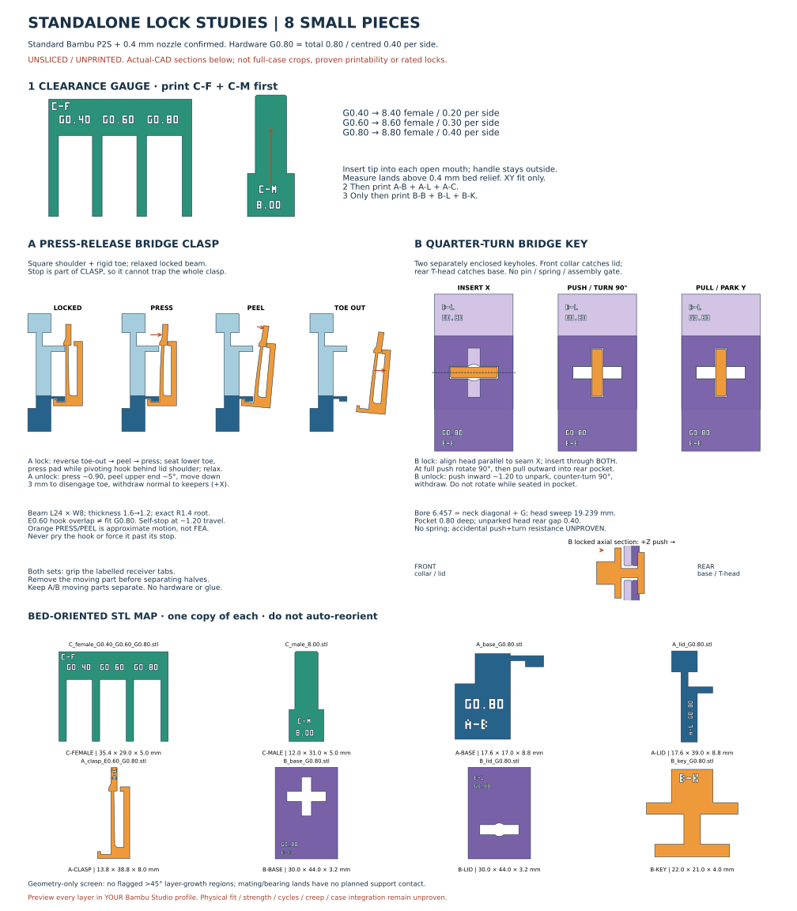

# Standalone mechanism coupons — NOT a case

**8 small parts, no hardware/glue, no optional variants. UNSLICED / UNPRINTED.**
The slide clip physically “barely slips in”; the earlier flush latch also failed.
These analytical coupons test a different positive clasp, a quarter-turn bridge
key and XY fit **before any further case work**. No original shell is imported,
cropped, repaired or regenerated. No full-case fit or carrying claim.



## Print in this order

1. **Gauge: 2 pieces** — C-F + C-M. Open widths 8.40 / 8.60 / 8.80; rail 8.00.
2. **Clasp: 3 pieces** — A-B + A-L + A-C. Broad cantilever, square retaining
   shoulder, rigid lower toe; positive stop travels with clasp, not receiver.
3. **Key: 3 pieces** — B-B + B-L + B-K. One-piece key through two independently
   enclosed holes; push → turn 90° → pull/park. No assembly gate or shaft assembly.

Exact filenames, label map, orientations, unknown profile settings and safe
hand tests: **[PRINT_TEST_GUIDE.md](PRINT_TEST_GUIDE.md)**.
Research/process distinctions: **[RESEARCH.md](RESEARCH.md)**.
All receivers are <44.01 mm maximum dimension. Print stages separately, not all
at once. G0.80 is **total mating gap 0.80 mm**, centred 0.40 per side, NOT hook
engagement or elastic travel. Gauge gaps remain their three independent values.

## Editable native CAD / rebuild

- `cad/lock-studies.FCStd`: Parameters + 8 live analytical FeaturePython parts;
  assembly coordinates kept separate from exported print orientations.
- `studies.py`: self-contained constructive geometry, root arc, fits and motions.
- `parameters.json`: rebuild inputs; `HardwareTotalGap` updates keeper/toe gaps,
  keyhole/bore/pocket dimensions and axial stack coherently. `HookOverlap` is
  separate. Baseline G0.80 / E0.60; validated fit-edit exercise G0.60. Do not
  casually change beam geometry or increase engagement beyond tested baseline.
- **Open with `Open.FCMacro` from FreeCAD's Macro menu**, keeping this directory
  intact. It imports the proxy, reopens/recomputes CAD and sets an assembly view.
  GUI parameter edits are live; to regenerate exports use the corresponding
  `parameters.json` value and wrapper. Raw STL files are not editable history.

No install/download is performed. Reused an existing extracted FreeCAD runtime
read-only. Supply your existing runtime, not a hardcoded worker path:

```bash
FREECAD_APPDIR=/path/to/squashfs-root bash opt/travel-case/lock-studies/run.sh
```

Also accepts an existing FreeCAD-capable Python via `FREECAD_PYTHON`, or ignored
local `.runtime/squashfs-root`. Requires FreeCAD/Part/Mesh, numpy, shapely and
matplotlib. `run.sh validate` rechecks saved files; `run.sh open` is a **headless**
macro self-check, not a desktop launch. All commands fail strictly; a failed build
cannot leave old STL exports or a success/hash manifest posing as a new build.

## Evidence, not qualification

`reports/validation.json` includes **295 enforced checks**, actual written STL
hashes/mesh topology, reopened fits and parameter update, locked/released motion
states, complete key rotational envelopes, and bounded horizontal-section support
screen. `SHA256SUMS` covers all 22 delivery assets other than itself. Caches and
runtime are ignored. No slicer CLI was found: **no G-code, estimated print times,
support toolpaths or physical results**. No flagged >0.10 mm² unsupported-growth
regions under the stated 0.20 mm / ~45° geometric screen is **not** slicer proof.

Strength, force, cycles, creep and accidental push+turn remain unproven. Later
real-section integration must revisit original 243.12 × 179.62 × 77.5, seam Z15,
floor 8 and curved lid shoulder; avoid underfloor projections and fiddly captive
parts. This kit does not authorize any case-body change or loaded travel.

## Additional C-only experiment — separate from the baseline kit

[C-tight](c-tight/README.md) adds **one female**, reusing your already printed
`C_male_8.00.stl`: left → right **0.20 / 0.10 / 0.00 mm per side** = engraved
**G0.40 / G0.20 / G0.00 total gaps**, widths **8.40 / 8.20 / 8.00 mm**.
It has its own live CAD, strict build, validation and hashes under `c-tight/`;
no A/B or original C rebuild. Zero nominal clearance may bind: **never force**.
