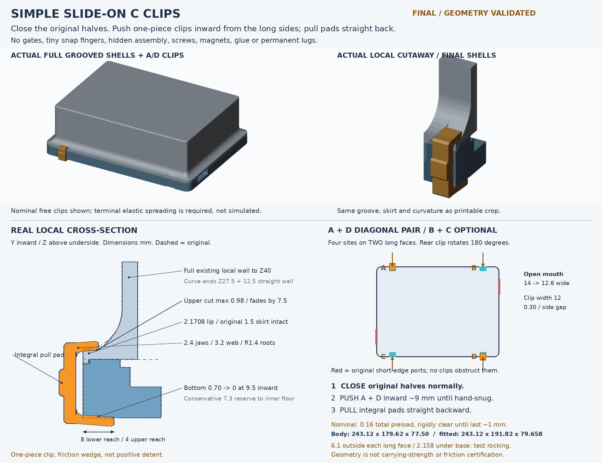
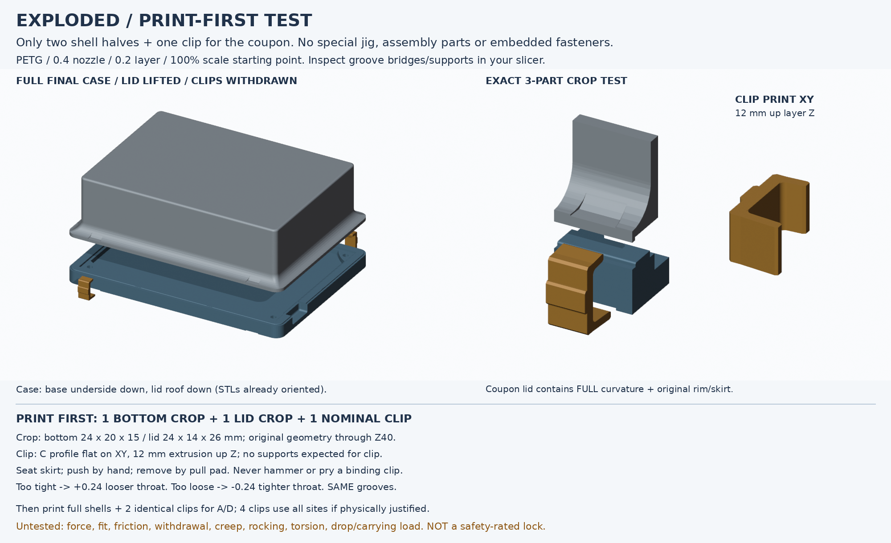

# Simple slide-on C-clip travel case — FINAL geometry / physical test required

**Physical-test warning:** the printed slide clip “barely slips in”; this is not
an acceptable fit or validated carrying lock. Do not proceed to full shells from
this result. Use the new [small standalone lock studies](../lock-studies/README.md)
(gauge first); all historical exports and sources here are preserved unchanged.



**One removable printed part per clip.** Seat the original lid, push a C clip
perpendicularly inward along two open-ended tapering grooves, and pull the integral
pad backwards to remove it. It behaves like reusable tape, not a hidden latch.
No gates, tiny fingers, clip assembly, screws, magnets, glue, captive mechanism,
added lugs or other moving parts. **Friction wedge, not a positive detent or safety lock.**

## Print first / BOM

| Purpose | Print |
| --- | --- |
| **First fit test** | **1 × `stl/coupon_bottom.stl`, 1 × `stl/coupon_lid.stl`, 1 × `stl/clip_nominal.stl`** |
| Nominal binds | Replace only clip with `clip_looser_throat_plus0.24.stl` |
| Nominal is loose | Replace only clip with `clip_tighter_throat_minus0.24.stl` |
| Full case, after satisfactory coupon | 1 × `case_bottom.stl`, 1 × `case_lid.stl`, 2 identical chosen-fit clips for A + D |
| Optional four-site arrangement | 4 identical chosen-fit clips at A/B/C/D; not a strength guarantee |

No special jig or hardware. Start with **PETG, 0.4 mm nozzle, 0.2 mm layer,
100% scale**; use a conservative PETG profile and solid/near-solid clips with
sufficient walls. Clip C-section lies flat on XY, its 12 mm width builds along Z.
All STLs are already bed-oriented. No clip supports expected; inspect the **case
and coupon groove bridges/overhangs** in the slicer. This is not a sliced or
physically qualified support recipe. See [PRINT_AND_ASSEMBLY.md](PRINT_AND_ASSEMBLY.md).

## Three steps

1. **Close:** seat the original lid/skirt normally on the base; no clip is needed
   to align the halves. On the coupon, seat the matching rim/skirt by hand.
2. **Push:** align both jaws with the paired groove mouths, push straight inward
   about 9 mm from the clear approach, stopping when hand-snug. No snap is expected.
3. **Pull:** hold the integral pad and draw the clip straight back out. Remove
   both clips before lifting the lid; do not hammer, twist-pry or force a binding fit.

Sites: A=(32,0), B=(211.12,0), C=(32,179.62), D=(211.12,179.62) mm in XY.
A + D is the **intended minimum diagonal placement**, not a certified carrying
arrangement. Rotate the same universal clip 180° about Z for C/D. Two sites on
each long face avoid the actual short-edge connector openings; arbitrary plug,
angled cable and hand envelopes are not certified.

## Final deliverables

- **`cad/slide-clips.FCStd`**: full original-sized repaired/grooved assembly, frozen
  untouched raw-release references, editable analytical repair/groove/clip/site/
  coupon features; A+D shown by `Open.FCMacro`, B+C available but hidden.
- **`Open.FCMacro`**: portable final opener; imports the local FeaturePython module,
  recomputes and sets useful visibility. Do not use the historical concept opener.
- **`parameters.json`, `clip_features.py`, `final_features.py`**: editable recipe;
  `Parameters.InterferencePerJaw`, `FitStepPerJaw`, jaw/web/root and groove
  dimensions are live. `ClipA`…`ClipD.OutwardOffset` previews straight removal.
- **Seven `stl/*.stl` files**: full base/lid, nominal/looser/tighter universal
  clips, and two real final-shell crop halves; each separately printed part is
  one solid/component, not an assembly of fragments.
- **Two previews:** [assembly](previews/assembly.png) and
  [exploded + test/print orientation](previews/exploded-test.png), from reopened
  final CAD exports, not uncut shell renders or substitute calibration blocks.
- **Evidence:** `reports/build.json`, `reports/validation.json`,
  `reports/delivery.json`, `SHA256SUMS`. `concept/` preserves the prior local-only
  handoff, explicitly historical and not the final build/print entry point.



## Dimensions and fit (mm)

| Feature | Final nominal |
| --- | --- |
| Body XYZ, unchanged | 243.12 × 179.62 × 77.50 |
| Fitted envelope, diagonal pair or four clips | 243.12 × 191.82 × 79.657895 |
| Removable projections | 6.10 per occupied long face; 2.157895 below original underside |
| Mouth / running groove width | 14.0 narrowing to 12.6; clip width 12.0 (0.30 side gap minimum) |
| Bottom underside groove | 0.70 maximum, fades to zero at 9.5 inward |
| Upper curved shoulder groove | 0.979444 maximum vertical cut, blends out by 7.5 inward |
| Upper bearing | Z17.05 + 0.08 × inward distance; 4.57° shallow ramp |
| Upper / lower jaw reach | 4.0 / 8.0; 0.7-long tip lead-in with 0.4 relief |
| Jaw / web / root radius | 2.4 / 3.2 / R1.4; no miniature flex fingers |
| Lid vertical material retained | Measured minimum 2.1708 at all four sites |
| Base floor reserve | Conservative 7.3 to original inner floor Z8 |
| Original alignment skirt | 1.5 thick, Z14…15, independently checked unchanged |
| Clip bed dimensions | 14.10 × 21.791895 × 12.00 |

The free clip is intentionally **not** collision-free when fully seated:

| Clip | Throat vs nominal | Interference / jaw | Total throat opening demanded |
| --- | ---: | ---: | ---: |
| Nominal (first print) | 0 | +0.08 | 0.16 |
| Looser `plus0.24` | +0.24 | −0.04 (clearance) | None; 0.08 total geometric gap |
| Tighter `minus0.24` | −0.24 | +0.20 | 0.40 |

All three use the **same final grooves and lead-ins**, with 2.4 mm jaws / 3.2 mm
web. Calibration changes only the throat, never global scale or shell geometry.
Looser can demonstrate fit but may not retain; tighter may require excessive force.
Nominal rigid motion is continuously clear from outward offset 9 to 1.2 mm;
first ideal bearing contact occurs around 1.086 lower / 1.0 upper. The last
~1 mm requires elasticity. Tighter first contact is ~2.714 / 2.5 mm and is
continuously clear from 9 to 2.8 mm. Do not mistake the reported overlap volumes
for a force/strain solution or use the tight variant merely to increase strength.

## Exact full-local-height coupon

The **real final shell crop** is X20…44, Y0…20, Z−1…40 at site A, with no added
jig, pedestal, generic block, weakened wall or substitute bearing surface.
Base retains its full 15 mm local height and original rim/cavity/floor profile.
Lid retains the original 1.5 skirt, entire flare up to Z27.5 and **12.5 mm of
existing straight 4 mm wall** to Z40. There is no mechanically necessary reason
to include the remote roof at Z77.5 for this *local fit* test. Coupon lid prints
24 × 14 × 26 mm, inverted on its Z40 cut straight-wall edge; base 24 × 20 × 15 mm.
Only the two coupon halves + the same universal clip are required. This preserves
the necessary local bending/curvature section, **not global case torsional stiffness**.

## Sources, repairs, and history honesty

Raw originals are immutable in [`../original/case_1.0.0`](../original/case_1.0.0),
from the [case_1.0.0 release](https://github.com/bread-modular/bread-modular/releases/tag/case_1.0.0).
Each final build verifies their hashes and freshly converts the raw meshes:
`X=releaseX−20.68, Y=−releaseZ−7.98, Z=releaseY+15`.
**No cut flush-latch shell or latch feature is imported.** Only its proven repair
mask definition was copied verbatim as a small source-repair function.

Repairs only: all 12 magnet recesses filled by overlapping 6.32-square patches,
base Z12.95…15, lid Z15…17.15, centred at (81.04,5), (162.08,5), (5,89.81),
(238.12,89.81), (81.04,174.62), (162.08,174.62); defective 0.5 mm *internal*
cosmetic recesses suppressed flush to original floor Z8 / roof Z75. Then four
paired shallow groove cuts. PCB holes, slots, connectors, cavity, source profile
and alignment skirt are independently compared with the original references.

**Mandatory tiny refinement:** the raw float32 rear face is Y179.620010376,
not decimal Y179.62. Both rear groove tools register to that measured face
(0.000010376 mm adjustment) to avoid an OCC tessellation sliver at the mouth.
Nominal clip positions/fit dimensions remain unchanged. No STL hole filling,
intersection deletion or mesh test suppression was used.

Original curves remain their released facets. FCStd contains editable analytical
**new** features over a faithful frozen faceted BRep, **not recovered native
Fusion history**. The upstream F3Z and archive inventory remain untouched;
no optional STEP translation or FEA claims.

## Rebuild and evidence

Requires an existing extracted FreeCAD AppImage (`AppRun python` + `usr/lib`),
Blender and system Python/Pillow. No automatic downloads or extraction:

```bash
FREECAD_APPDIR=/path/to/squashfs-root bash opt/travel-case/slide-clips/run.sh --clean
```

Default runtime, if provided locally: `.runtime/squashfs-root` (ignored).
This implementation reused the handoff runtime read-only; **no workspace-269
absolute path is embedded in the wrapper or macro**. `set -euo pipefail` enforces
build → reopen/recompute validation → previews → hash generation/checks. Build
removes previous final exports/success reports before creating new ones; clean
mode also removes the release cache. Original-source conversion is fresh anyway.
The wrapper opens only final CAD, never the concept. `Open.FCMacro` can be run
from FreeCAD's Macro menu after moving the entire directory; keep both feature
modules beside it. A stale report does not count as a successful build.

Validation enforces original body envelope; whole-shell difference limited to
explicit groove/repair masks; independent interfaces; all magnet cores/mouths
filled; zero inter-half material overlap; valid single-solid CAD; exact crop;
all four continuous rigid approach/withdrawal paths and quantified terminal
preload; .02 gap/jaw surrogate capturing both halves at .30 separation; live
fit/thickness/groove edit and restoration; written binary STL topology, bed Z0
and byte identity with independently remeshed reopened/recomputed final geometry.
Hashes are regenerated then verified, including original provenance hashes.

**Physical limits:** no printed fit, elastic force, friction, removal effort,
creep, cyclic wear, rocking, carrying, twist/peel, drop or temperature test has
been performed. Two clips introduce new tabletop contact points below the
base and can change stability: test manually. The diagonal pair's geometric
capture is **not** evidence of carrying strength. Keep a hand under the base;
use independent containment for transport until real testing is satisfactory.
