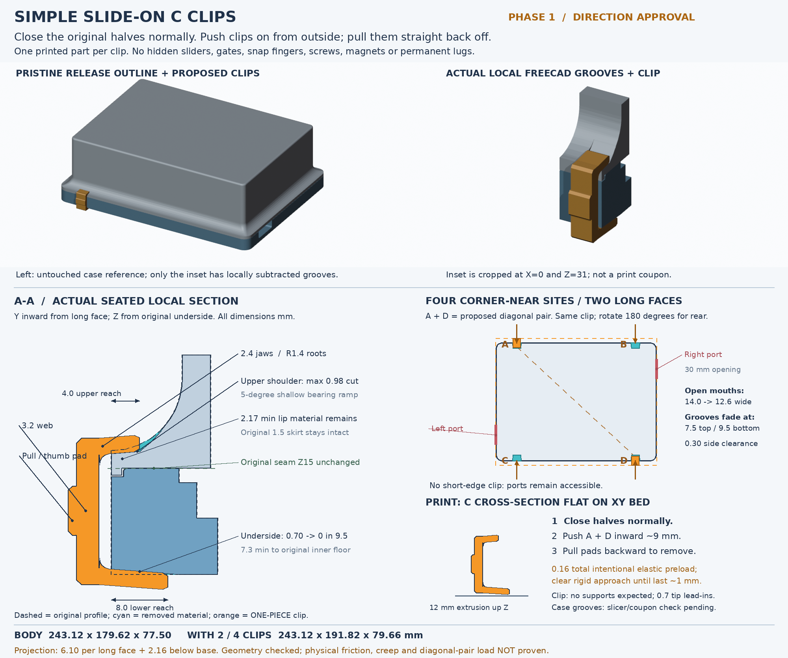

> **Historical measured local-only handoff. FINAL CAD/build/print files are in [..](../README.md).**
> The approval direction was selected; no further selection/approval is requested.
> These preserved concept artifacts are not full shells or a print-test coupon.

# Simple slide-on C clips — phase 1 / direction approval only

**This is the user's reusable-tape idea, not another internal latch.** Close the
original lid and base normally, push one-piece printed clips onto paired exterior
grooves, and pull the clips straight backwards to remove them. No screws,
magnet fittings, internal sliders, gates, tiny snap fingers, tools or clip assembly.

## Source and phase boundary

- Pristine [case_1.0.0 release](https://github.com/bread-modular/bread-modular/releases/tag/case_1.0.0),
  preserved under `../original/case_1.0.0`. Both raw STLs were freshly converted
  by FreeCAD. Original transform: `X=releaseX-20.68, Y=-releaseZ-7.98, Z=releaseY+15`.
- Isolated workspace 269 is based on `case-improvements`, commit
  `30de78d29080433e4c98bf7f6a16658b15b3fc1e`. No branch switch, commit, merge or push.
- **No machined flush-latch geometry was imported or reused.** That failed design
  and its README remain untouched for history. Root README supersession is later work.
- `cad/slide-clip-concept.FCStd` contains editable local FeaturePython groove/clip
  features and untouched release-derived local reference crops. It is **not a full
  grooved case**. Use `Open.FCMacro` so the feature module is available when opening.
- The single image's full-case view is the **untouched release outline plus placed
  concept clips**; the local inset and cross-section show the actual subtractive
  groove prototype. The local model is cropped at Z31, not a print-test coupon.
- Only a clearly marked concept clip STL is supplied. No full grooved shell meshes,
  full-height paired-shell coupon, fit variants or production release were built.

## Operation and placement

1. Seat the original lid normally; the seam remains Z15 and the skirt remains Z14..15.
2. Align the upper jaw with the lid's **low flared/curving shoulder** and the lower
   jaw with the **base underside**. Push perpendicular to the long face, about 9 mm
   from a wholly clear approach, until hand-snug. No sliding rail inside the lid.
3. Use sites **A + D** for the proposed diagonal pair. The same clip fits all sites;
   rotate it 180 degrees about Z for the rear edge. Pull its integral thumb/pull pad
   straight back out to remove. The clip is completely removable, not captive.

Four sites are near the four corners, but **two on each long face**, not one on
all four faces: centres X32 and X211.12 on Y0 and Y179.62. The short edges have
real connector interruptions. A Z12 scan through the outer base measured the
right opening at Y25..55 and left opening at Y124.62..154.62. No clip is placed
there; the nearest clip X span is 26 mm away from a short edge, and its approach
remains in that same X band. Cable/plug envelopes were not supplied, so clearance
of an arbitrary oversized or angled plug is **not** certified.

## Actual groove / clip geometry (mm)

| Feature | Concept measurement |
| --- | --- |
| Groove width | 14.0 open mouth, smoothly narrows to 12.6 running width |
| Clip width along edge | 12.0; minimum 0.30 clearance per groove side |
| Base underside groove | 0.70 maximum depth, linear fade to zero at 9.5 inward |
| Upper shoulder bearing | Z17.05 + 0.08 * Y, through Y0..4.0; 4.57-degree ramp |
| Upper groove removal | 0.98 maximum vertical depth; fades into original curve by Y7.5 |
| Lower/upper jaw reach | 8.0 / 4.0; 0.7-long tip lead-ins, 0.4 tip relief |
| Clip jaws / web | 2.4 jaw thickness / 3.2 web thickness |
| Jaw roots | R1.4; rounded roots remain entirely outside the original wall |
| Material remaining | 2.1708 minimum sampled vertical lid-lip material; conservative 7.30 to inner floor Z8 |
| Skirt / seam / interior | Original 1.5 skirt thickness; seam, floor, inner walls and PCB-side features untouched locally |

The two grooves are **open to the exterior**, not sealed blind slots. Within the
loaded segment, the upper bearing rises gently and the underside groove gets
shallower: the effective paired grip thickness rises 0.154 per inward mm. After
the bearing length the upper groove blends away into the real curved shoulder;
the bottom ramp likewise disappears into the original underside. There is no
barb, detent, positive-lock mechanism or hidden assembly step.

**Binding deliberately needs elasticity:** the free clip has 0.08 interference
per jaw (0.16 total throat opening). Samples at outward offsets 9, 4, 1.5 and
1.2 were rigidly clear at every site. Samples at 0.5 and seated 0 intentionally
intersect the bearing faces: this is expected preload, **not** a proven rigid
collision-free final fit, and no FEA/deflection force is claimed. Withdrawal
loosens this wedge. Friction, spring force, tolerance and creep remain untested.

A separate rigid clearance surrogate, with 0.02 gap per jaw, was clear when
seated and blocked both a 0.30 lid lift and a 0.30 base drop at each site. Thus
the two opposed jaws geometrically capture both halves at A and D. This does
**not** establish carrying strength, resistance to twisting/peeling, impact or
safe physical load capacity for a diagonal pair.

## Original body and removable-clip envelope

| Closed arrangement | Width X | Depth Y | Height Z |
| --- | ---: | ---: | ---: |
| Pristine / locally grooved body | 243.119995 | 179.620010 | 77.500000 |
| With diagonal pair, or four clips | 243.119995 | 191.820000 | 79.657895 |

The removable clips project **6.10 beyond each occupied long face** and
**2.158 below the base**; no permanent lug or body extension is proposed.
Tabletop contact/stability changes while clips are fitted and requires a physical
check. Original case profile and dimensions are preserved except the shallow,
local subtractive grooves. Full-case preservation checks are a later phase.

## Print orientation and evidence

- Clip STL is already bed oriented: its C cross-section lies in **XY**; the 12 mm
  edge width becomes layer Z. Jaw/web bending loads stay in the layer plane.
- Bed-oriented dimensions are 14.10 x 21.79 x 12.00. The entire C profile is a
  constant extrusion, so **no clip supports are expected**. 2.4 jaws and 3.2 web
  avoid tiny printable features for a 0.4 nozzle. The integral pad is solid.
- PETG is the proposed coupon starting material; no physical material/strength
  claim, verified slicer profile or approved fit tolerance is supplied yet.
- The future body orientation is base underside-down and lid roof-down. The
  shallow open exterior grooves still need actual slicer inspection; body support
  requirements have not been certified in this phase.
- The **written** concept clip STL is closed, manifold, one component, consistently
  oriented and without self-intersections. Local CAD reopened and recomputed.
  See `reports/concept-checks.json`; measurements come from the real source, not a
  generic enclosure or the previously cut latch slots.
- Groove tools at all sites were checked against the prescribed 6.32-square fill
  patches for all 12 magnet recesses: **zero overlap**. No pocket is re-opened by
  these grooves. In phase 2 the complete shells must fill those pockets and only
  the defective cosmetic engravings flush to floor Z8 / roof Z75; no whole-shell
  thickening. Those full-case repairs are deliberately not done in this local phase.

## Review assets / rebuilding

- `previews/concept-handoff.png`: the one annotated handoff image.
- `cad/slide-clip-concept.FCStd`, `clip_features.py`, `concept-parameters.json`:
  local editable concept only.
- `prototype/clip_concept_NOT_FIT_TESTED.stl`: support-free orientation proposal,
  **not** a fitted or print-approved closure.
- `reports/pristine-measurements.json`: fresh release wall/shoulder/port survey.
- `reports/concept-checks.json`: local path, geometric capture, thickness, envelope
  and actual written clip mesh checks.
- `SHA256SUMS`: hashes for staged review assets.

Run `bash opt/travel-case/slide-clips/run.sh` from the repository root. The wrapper
uses `FREECAD_APPDIR` when provided, otherwise the previously established runtime
or the ignored local `.runtime/squashfs-root`. This session's vanished /tmp runtime
was recovered from the already-installed AppImage locally; no installation or
system changes. The wrapper stops immediately on failure. Blender renders only
the existing pristine meshes plus these local shapes. No STEP or full-case exports.

**Stop here for user direction approval.** Future work, only if authorized: full
original-size grooved shells, the prescribed repairs, tight/nominal/loose clip
variants, a real full-height two-half coupon + one clip, strict written-STL checks,
and hand-fit/withdrawal/creep/stability/load testing before final claims.
